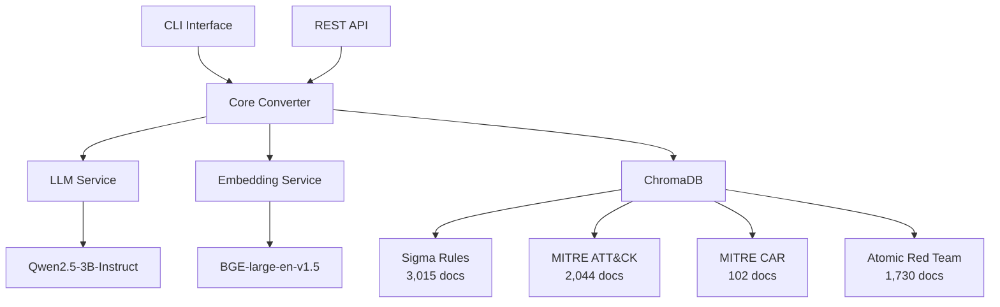

# Canonical SIEM Rule Converter

<div align="center">


**An intelligent SIEM rule converter that transforms security detection rules between different formats using AI and contextual intelligence.**

[Features](#-features) • [Quick Start](#-quick-start) • [Documentation](#-documentation) • [License](#-license)

</div>

---

## 🎯 Overview

Canonical is an advanced SIEM rule converter designed specifically for **Security Operations Centers (SOCs)**, **Managed Detection and Response (MDR)** services, and **enterprise cybersecurity teams**. It leverages cutting-edge AI techniques to provide context-aware, intelligent rule conversions with high accuracy and comprehensive security intelligence.

### 🏢 Target Audience
- **Security Operations Centers (SOCs)**
- **Managed Detection and Response (MDR) providers**
- **Corporate cybersecurity teams**
- **Security researchers and analysts**
- **Educational institutions (cybersecurity programs)**

## ✨ Features

### 🔄 **Multi-Format Rule Conversion**
- **Sigma** → **KustoQL** (Azure Sentinel)
- **Sigma** → **KibanaQL** (Elastic SIEM)
- **Sigma** → **EQL** (Event Query Language)
- **Sigma** → **Splunk SPL** (Splunk Enterprise Security)
- **Sigma** → **QRadar AQL** (IBM QRadar)

### 🧠 **AI-Powered Intelligence**
- **Context-Aware Conversions**: Uses vector similarity search across 6,891+ security rules
- **MITRE ATT&CK Integration**: Automatic technique mapping and enrichment
- **Confidence Scoring**: AI-generated confidence levels for each conversion
- **Semantic Understanding**: Advanced language models for accurate translations

### 📊 **Comprehensive Knowledge Base**
- **3,015 Sigma Rules** from SigmaHQ repository
- **2,044 MITRE ATT&CK** techniques, tactics, groups, and mitigations
- **102 MITRE CAR** analytics for additional detection context
- **1,730 Atomic Red Team** tests for validation procedures

### 🚀 **Enterprise-Ready**
- **REST API**: Full API server with OpenAPI documentation
- **CLI Interface**: Command-line tools for batch processing
- **Docker Support**: Containerized deployment
- **Scalable Architecture**: From single-node to microservices

## 🚀 Quick Start

### Prerequisites
- Python 3.9+
- 8+ GB RAM (16 GB recommended)
- 10+ GB storage space
- Git

### Installation

1. **Clone the repository**
   ```bash
   git clone https://github.com/dier/canonical.git
   cd canonical
   ```

2. **Install dependencies**
   ```bash
   pip3 install -r requirements.txt
   ```

3. **Configure environment**
   ```bash
   cp env.example .env
   # Edit .env with your settings
   ```

4. **Initialize data (one-time setup)**
   ```bash
   # Ingest all security intelligence data (~5-10 minutes)
   python3 -m src.canonical.cli data ingest-all --force-refresh
   ```

### Basic Usage

#### CLI Conversion
```bash
# Convert a single Sigma rule to KustoQL
python3 -m src.canonical.cli convert rule.yml kustoql

# Batch convert multiple rules
python3 -m src.canonical.cli batch-convert ./rules/ kustoql --output-dir ./converted/

# Validate a rule
python3 -m src.canonical.cli validate rule.yml
```

#### API Server
```bash
# Start the API server
python3 -m src.canonical.cli serve --host 0.0.0.0 --port 8000

# Access API documentation at http://localhost:8000/docs
```

#### Example Conversion
```python
import asyncio
from src.canonical.core.converter import rule_converter

async def convert_rule():
    sigma_rule = """
    title: Suspicious PowerShell Execution
    detection:
        selection:
            Image|endswith: 'powershell.exe'
            CommandLine|contains: 'EncodedCommand'
        condition: selection
    """
    
    result = await rule_converter.convert_rule(
        source_rule=sigma_rule,
        source_format="sigma",
        target_format="kustoql"
    )
    
    print(f"Converted Rule: {result.target_rule}")
    print(f"Confidence: {result.confidence_score}")

asyncio.run(convert_rule())
```

## 📚 Documentation

### 📖 Core Documentation
- [System Requirements](SYSTEM_REQUIREMENTS.md) - Hardware and software requirements
- [Installation Guide](docs/installation.md) - Detailed setup instructions
- [API Reference](docs/api.md) - Complete API documentation
- [CLI Reference](docs/cli.md) - Command-line interface guide

### 🔧 Advanced Topics
- [Architecture Overview](docs/architecture.md) - System design and components
- [Configuration Guide](docs/configuration.md) - Environment and settings
- [Deployment Guide](docs/deployment.md) - Production deployment strategies
- [Performance Tuning](docs/performance.md) - Optimization techniques

### 🎓 Examples and Tutorials
- [Basic Usage Examples](examples/) - Simple conversion examples
- [Integration Patterns](docs/integration.md) - Common integration scenarios
- [Custom Extensions](docs/extensions.md) - Building custom converters

## 🏗️ Architecture



## 🔒 License & Usage

### License
This project is licensed under a **Custom License** that permits:
- ✅ Internal use within SOCs, MDRs, and corporate security teams
- ✅ Modification and customization for internal use
- ✅ Educational and research purposes
- ❌ Commercial redistribution or resale
- ❌ Creating competing commercial products
- ❌ Hosting as a commercial service

See [LICENSE](LICENSE) for full terms.

### Compliance Requirements
Organizations using Canonical must:
- Use it solely for internal security operations
- Not redistribute or share access with external parties
- Maintain confidentiality of modifications
- Provide attribution to DIER in any public documentation

### Commercial Licensing
For commercial licensing, partnerships, or questions about permitted uses:
📧 **Contact**: team@dierhq.com

## 🤝 Contributing

We welcome contributions from the cybersecurity community! Please read our [Contributing Guidelines](CONTRIBUTING.md) before submitting:

- 🐛 **Bug Reports**: Use GitHub Issues
- 💡 **Feature Requests**: Use GitHub Discussions
- 🔧 **Code Contributions**: Submit Pull Requests
- 📖 **Documentation**: Help improve our docs

### Development Setup
```bash
# Clone and setup development environment
git clone https://github.com/dier/canonical.git
cd canonical
pip3 install -r requirements-dev.txt
pre-commit install
```

## 📊 Performance

### Conversion Speed
- **CPU Only**: 2-5 seconds per rule
- **GPU Accelerated**: 0.5-2 seconds per rule
- **Batch Processing**: 50-400 rules/minute

### Accuracy Metrics
- **Conversion Success Rate**: >95%
- **Confidence Scores**: 0.85-0.98 average
- **MITRE Mapping Accuracy**: >90%

## 🆘 Support

### Community Support
- 📖 **Documentation**: Comprehensive guides and examples
- 💬 **GitHub Discussions**: Community Q&A and feature requests
- 🐛 **GitHub Issues**: Bug reports and technical issues

### Enterprise Support
For enterprise deployments and custom requirements:
- 📧 **Email**: team@dierhq.com
- 🤝 **Partnerships**: Custom licensing and support agreements
- 🔧 **Professional Services**: Implementation and customization

## 🙏 Acknowledgments

### Data Sources
- **SigmaHQ**: Sigma detection rules repository
- **MITRE Corporation**: ATT&CK framework and CAR analytics
- **Red Canary**: Atomic Red Team testing procedures

### Technology Stack
- **Qwen2.5**: Advanced language model by Alibaba
- **BGE**: Text embedding model by BAAI
- **ChromaDB**: Vector database for semantic search
- **FastAPI**: Modern web framework for APIs

---

<div align="center">

**Built with ❤️ by [DIER](https://dierhq.com) for the cybersecurity community**

[⭐ Star this repo](https://github.com/dier/canonical) • [🐛 Report bug](https://github.com/dier/canonical/issues) • [💡 Request feature](https://github.com/dier/canonical/discussions)

</div> 