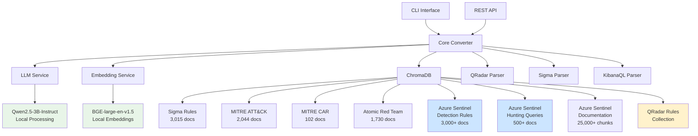

# Canonical SIEM Rule Converter

<div align="center">


**An intelligent SIEM rule converter that transforms security detection rules between different formats using local LLM and contextual intelligence.**

[Features](#-features) • [Quick Start](#-quick-start) • [Documentation](#-documentation) • [License](#-license)

</div>

---

## 🆕 **Foundation-Sec-8B Upgrade**

**MAJOR UPDATE**: Canonical now uses **Foundation-Sec-8B by Cisco** as the primary LLM for superior cybersecurity performance!

### 🚀 **Why Foundation-Sec-8B?**
- **🎯 Purpose-Built**: Specialized for cybersecurity (trained on 5.1B tokens of security data)
- **📈 Better Performance**: 5-13% improvement on cybersecurity benchmarks vs general models
- **🛡️ Domain Expertise**: Deep knowledge of CVEs, CWEs, MITRE ATT&CK, threat intelligence
- **🔧 SIEM Optimized**: Enhanced rule conversion accuracy for all supported formats
- **🏢 Enterprise Ready**: Apache 2.0 license, local deployment, air-gapped compatible

### ⚡ **Intelligent Model Selection**
- **Primary**: Foundation-Sec-8B for cybersecurity tasks
- **Fallback**: Qwen 2.5-3B for compatibility and general tasks  
- **Auto-Quantization**: 4-bit quantization on systems with <24GB VRAM
- **Smart Routing**: Automatic model selection based on task requirements

### 💾 **System Requirements**
- **Memory**: 32GB+ RAM (vs 16GB for Qwen-only)
- **GPU**: 16GB+ VRAM recommended (RTX A6000, V100, A100)
- **Storage**: Additional 10GB for Foundation-Sec-8B model

---

## 🎯 Overview

Canonical is an advanced SIEM rule converter designed specifically for **Security Operations Centers (SOCs)**, **Managed Detection and Response (MDR)** services, and **enterprise cybersecurity teams**. It leverages local LLM processing and on-premises intelligence to provide context-aware, intelligent rule conversions with high accuracy and comprehensive security intelligence - perfect for air-gapped and secure environments.

### 🏢 Target Audience
- **Security Operations Centers (SOCs)**
- **Managed Detection and Response (MDR) providers**
- **Corporate cybersecurity teams**
- **Security researchers and analysts**
- **Educational institutions (cybersecurity programs)**
- **Organizations migrating from QRadar to Azure Sentinel**

## ✨ Features

### 🔄 **Multi-Format Rule Conversion**
- **Sigma** → **KustoQL** (Azure Sentinel)
- **Sigma** → **KibanaQL** (Elastic SIEM)
- **Sigma** → **EQL** (Event Query Language)
- **Sigma** → **Splunk SPL** (Splunk Enterprise Security)
- **Sigma** → **QRadar AQL** (IBM QRadar)
- **QRadar** → **KustoQL** (Azure Sentinel)
- **KibanaQL** → **KustoQL** (Azure Sentinel) - **🆕 NEW**
- **KibanaQL** → **KibanaQL** (Elastic SIEM) - **🆕 NEW**
- **KibanaQL** → **EQL** (Event Query Language) - **🆕 NEW**
- **KibanaQL** → **QRadar AQL** (IBM QRadar) - **🆕 NEW**
- **KibanaQL** → **Splunk SPL** (Splunk Enterprise Security) - **🆕 NEW**
- **KibanaQL** → **Sigma** (Universal Detection Format) - **🆕 NEW**

**Total**: **12 conversion paths** across **3 source formats** and **6 target formats**

### 🧠 **Local LLM Intelligence**
- **On-Premises Processing**: Local Qwen2.5-3B-Instruct LLM with no external API calls
- **Context-Aware Conversions**: Uses vector similarity search across 35,000+ security documents
- **Enhanced Azure Sentinel Context**: 25,000+ documentation chunks for superior KustoQL conversions
- **MITRE ATT&CK Integration**: Automatic technique mapping and enrichment
- **Confidence Scoring**: LLM-generated confidence levels for each conversion (85-95%+)
- **Semantic Understanding**: Advanced language models for accurate translations
- **Air-Gapped Compatible**: Fully self-contained with local embeddings (BGE-large-en-v1.5)

### 📊 **Comprehensive Knowledge Base**
- **3,015 Sigma Rules** from SigmaHQ repository
- **3,000+ Azure Sentinel Detection Rules** from Microsoft's GitHub repository
- **500+ Azure Sentinel Hunting Queries** for threat hunting context
- **25,000+ Azure Sentinel Documentation Chunks** from comprehensive 3000-page PDF - **🆕 NEW**
- **2,044 MITRE ATT&CK** techniques, tactics, groups, and mitigations
- **102 MITRE CAR** analytics for additional detection context
- **1,730 Atomic Red Team** tests for validation procedures
- **QRadar Rules Collection** for similarity analysis and context enhancement

**Total**: **35,000+ documents** for context-aware conversions

### 🔄 **QRadar Migration Support**
- **Comprehensive QRadar Parser**: Supports EVENT, FLOW, OFFENSE, and COMMON rule types
- **Advanced Field Mapping**: Intelligent QRadar → KustoQL field translation
- **Operator Conversion**: QRadar operators → KustoQL equivalents (=, ilike, matches, etc.)
- **Time Window Translation**: QRadar time expressions → KustoQL `ago()` syntax
- **Context Enhancement**: Uses Azure Sentinel examples for better conversion accuracy
- **Batch Processing**: Convert large QRadar rule sets efficiently
- **Validation & Quality**: Rule syntax checking and confidence scoring

### 🚀 **Enterprise-Ready**
- **REST API**: Full API server with OpenAPI documentation
- **CLI Interface**: Command-line tools for batch processing
- **Docker Support**: Containerized deployment
- **Scalable Architecture**: From single-node to microservices

## 🚀 Quick Start

### Prerequisites
- Python 3.9+
- 8+ GB RAM (16 GB recommended)
- 10+ GB storage space
- Git

### Installation

1. **Clone the repository**
   ```bash
   git clone https://github.com/dier/canonical.git
   cd canonical
   ```

2. **Install dependencies**
   ```bash
   pip3 install -r requirements.txt
   ```

3. **Configure environment**
   ```bash
   cp .env.example .env
   # Edit .env with your settings
   ```

4. **Initialize data (one-time setup)**
   ```bash
   # Ingest all security intelligence data (~5-10 minutes)
   python3 -m src.canonical.cli data ingest-all --force-refresh
   
   # Optional: Ingest Azure Sentinel documentation for enhanced conversions (~20-35 minutes)
   python3 -m src.canonical.cli data ingest-azure-docs
   ```

### Basic Usage

#### CLI Conversion
```bash
# Convert a single Sigma rule to KustoQL
python3 -m src.canonical.cli convert rule.yml kustoql

# Convert QRadar rule to KustoQL
python3 -m src.canonical.cli convert qradar_rule.txt kustoql

# Convert KibanaQL rule to KustoQL
python3 -m src.canonical.cli convert kibana_rule.json kustoql --source-format kibanaql

# Convert KibanaQL rule to Sigma
python3 -m src.canonical.cli convert kibana_rule.json sigma --source-format kibanaql

# Batch convert multiple rules
python3 -m src.canonical.cli batch-convert ./rules/ kustoql --output-dir ./converted/

# Validate a rule (supports Sigma, QRadar, and KibanaQL)
python3 -m src.canonical.cli validate rule.yml
python3 -m src.canonical.cli validate qradar_rule.txt --source-format qradar
python3 -m src.canonical.cli validate kibana_rule.json --source-format kibanaql
```

#### API Server
```bash
# Start the API server
python3 -m src.canonical.cli serve --host 0.0.0.0 --port 8000

# Access API documentation at http://localhost:8000/docs
```

#### API Usage Examples
```bash
# Convert QRadar rule to KustoQL via API
curl -X POST "http://localhost:8000/convert/qradar/kustoql" \
  -H "Content-Type: application/json" \
  -d '{"rule": "when the event QID is one of the following \"4688\" and when the process name contains \"powershell.exe\""}'

# Convert KibanaQL rule to KustoQL via API
curl -X POST "http://localhost:8000/convert/kibanaql/kustoql" \
  -H "Content-Type: application/json" \
  -d '{"rule": "{\"name\": \"Suspicious PowerShell\", \"query\": \"process.name:powershell.exe AND process.command_line:*EncodedCommand*\"}"}'

# Convert KibanaQL rule to Sigma via API
curl -X POST "http://localhost:8000/convert/kibanaql/sigma" \
  -H "Content-Type: application/json" \
  -d '{"rule": "{\"name\": \"Suspicious PowerShell\", \"query\": \"process.name:powershell.exe AND process.command_line:*EncodedCommand*\"}"}'

# Ingest Azure Sentinel rules
curl -X POST "http://localhost:8000/ingest/azure-sentinel" \
  -H "Content-Type: application/json" \
  -d '{"force_refresh": false}'

# Validate KibanaQL rule
curl -X POST "http://localhost:8000/validate" \
  -H "Content-Type: application/json" \
  -d '{"rule": "KibanaQL rule content", "source_format": "kibanaql"}'
```

#### Example Conversions

**Sigma to KustoQL:**
```python
import asyncio
from src.canonical.core.converter import RuleConverter

async def convert_sigma_rule():
    converter = RuleConverter()
    await converter.initialize()
    
    sigma_rule = """
    title: Suspicious PowerShell Execution
    detection:
        selection:
            Image|endswith: 'powershell.exe'
            CommandLine|contains: 'EncodedCommand'
        condition: selection
    """
    
    result = await converter.convert_rule(
        source_rule=sigma_rule,
        source_format="sigma",
        target_format="kustoql"
    )
    
    print(f"Converted Rule: {result.target_rule}")
    print(f"Confidence: {result.confidence_score}")

asyncio.run(convert_sigma_rule())
```

**QRadar to KustoQL:**
```python
import asyncio
from src.canonical.core.converter import RuleConverter

async def convert_qradar_rule():
    converter = RuleConverter()
    await converter.initialize()
    
    qradar_rule = """
    Rule Name: Suspicious PowerShell Execution
    Description: Detects suspicious PowerShell command execution
    Rule Type: EVENT
    Enabled: true
    Severity: 7
    
    when the event(s) are detected by the Local system
    and when the event QID is one of the following "4688"
    and when the process name contains "powershell.exe"
    and when the command line contains "-EncodedCommand"
    and when the event(s) occur in the last 5 minutes
    """
    
    result = await converter.convert_qradar_to_kustoql(qradar_rule)
    
    print(f"Converted Rule: {result.target_rule}")
    print(f"Confidence: {result.confidence_score}")
    print(f"Field Mappings: {result.metadata.get('field_mappings', {})}")

asyncio.run(convert_qradar_rule())
```

**KibanaQL to KustoQL:**
```python
import asyncio
from src.canonical.core.converter import RuleConverter

async def convert_kibanaql_rule():
    converter = RuleConverter()
    await converter.initialize()
    
    kibanaql_rule = """
    {
        "name": "Suspicious PowerShell Execution",
        "description": "Detects suspicious PowerShell command execution with encoded commands",
        "query": "process.name:powershell.exe AND process.command_line:*EncodedCommand*",
        "index_patterns": ["winlogbeat-*", "logs-endpoint.events.process-*"],
        "language": "kuery",
        "query_type": "query",
        "severity": "high",
        "risk_score": 73,
        "tags": ["T1059.001", "PowerShell", "Execution"],
        "interval": "5m",
        "from_time": "now-6m",
        "threat": [
            {
                "framework": "MITRE ATT&CK",
                "tactic": {
                    "id": "TA0002",
                    "name": "Execution"
                },
                "technique": {
                    "id": "T1059.001",
                    "name": "PowerShell"
                }
            }
        ]
    }
    """
    
    result = await converter.convert_kibanaql_to_kustoql(kibanaql_rule)
    
    print(f"Converted Rule: {result.target_rule}")
    print(f"Confidence: {result.confidence_score}")
    print(f"MITRE Techniques: {result.mitre_techniques}")

asyncio.run(convert_kibanaql_rule())
```

**KibanaQL to Sigma:**
```python
import asyncio
from src.canonical.core.converter import RuleConverter

async def convert_kibanaql_to_sigma():
    converter = RuleConverter()
    await converter.initialize()
    
    kibanaql_rule = """
    {
        "name": "Suspicious PowerShell Execution",
        "description": "Detects suspicious PowerShell command execution with encoded commands",
        "query": "process.name:powershell.exe AND process.command_line:*EncodedCommand*",
        "index_patterns": ["winlogbeat-*", "logs-endpoint.events.process-*"],
        "language": "kuery",
        "query_type": "query",
        "severity": "high",
        "risk_score": 73,
        "tags": ["T1059.001", "PowerShell", "Execution"],
        "author": "Security Team",
        "references": ["https://attack.mitre.org/techniques/T1059/001/"],
        "threat": [
            {
                "framework": "MITRE ATT&CK",
                "tactic": {
                    "id": "TA0002",
                    "name": "Execution"
                },
                "technique": {
                    "id": "T1059.001",
                    "name": "PowerShell"
                }
            }
        ]
    }
    """
    
    result = await converter.convert_kibanaql_to_sigma(kibanaql_rule)
    
    print(f"Converted Rule: {result.target_rule}")
    print(f"Confidence: {result.confidence_score}")
    print(f"MITRE Techniques: {result.mitre_techniques}")

asyncio.run(convert_kibanaql_to_sigma())
```

## 📚 Documentation

### 📖 Core Documentation
- [System Requirements](system-requirements.md) - Hardware and software requirements
- [Installation Guide](docs/installation.md) - Detailed setup instructions
- [API Reference](docs/api.md) - Complete API documentation
- [CLI Reference](docs/cli.md) - Command-line interface guide

### 🔧 Advanced Topics
- [Architecture Overview](docs/architecture.md) - System design and components
- [Configuration Guide](docs/configuration.md) - Environment and settings
- [Deployment Guide](docs/deployment.md) - Production deployment strategies
- [Performance Tuning](docs/performance.md) - Optimization techniques

### 🎓 Examples and Tutorials
- [Basic Usage Examples](examples/) - Simple conversion examples
- [QRadar to KustoQL Migration](examples/qradar_to_kustoql_example.py) - QRadar migration example
- [Integration Patterns](docs/integration.md) - Common integration scenarios
- [Custom Extensions](docs/extensions.md) - Building custom converters
- [QRadar Migration Guide](docs/qradar-migration.md) - Complete migration workflow

## 🏗️ Architecture



## 📊 Performance

### Conversion Speed
- **Sigma Rules**: 2-5 seconds per rule (CPU only)
- **QRadar Rules**: 5-15 seconds per rule (includes context gathering)
- **Batch Processing**: 50-200 rules/minute
- **Local Processing**: No external API latency

### Accuracy Metrics
- **Conversion Success Rate**: >95% for Sigma, >90% for QRadar
- **Confidence Scores**: 0.85-0.98 average for Sigma, 0.75-0.95 for QRadar
- **MITRE Mapping Accuracy**: >90%
- **Field Mapping Accuracy**: >95% for common fields

### Resource Requirements
- **RAM**: 8GB minimum, 16GB recommended
- **CPU**: Multi-core recommended for batch processing
- **Storage**: 10GB+ for full knowledge base
- **Network**: None required for conversion (air-gapped compatible)

## 🔒 License & Usage

### License
This project is licensed under a **Custom License** that permits:
- ✅ Internal use within SOCs, MDRs, and corporate security teams
- ✅ Modification and customization for internal use
- ✅ Educational and research purposes
- ❌ Commercial redistribution or resale
- ❌ Creating competing commercial products
- ❌ Hosting as a commercial service

See [license](license) for full terms.

### Compliance Requirements
Organizations using Canonical must:
- Use it solely for internal security operations
- Not redistribute or share access with external parties
- Maintain confidentiality of modifications
- Provide attribution to DIER in any public documentation

### Commercial Licensing
For commercial licensing, partnerships, or questions about permitted uses:
📧 **Contact**: team@dierhq.com

## 🤝 Contributing

We welcome contributions from the cybersecurity community! Please read our [Contributing Guidelines](contributing.md) before submitting:

- 🐛 **Bug Reports**: Use GitHub Issues
- 💡 **Feature Requests**: Use GitHub Discussions
- 🔧 **Code Contributions**: Submit Pull Requests
- 📖 **Documentation**: Help improve our docs

### Development Setup
```bash
# Clone and setup development environment
git clone https://github.com/dier/canonical.git
cd canonical
pip3 install -r requirements-dev.txt
pre-commit install
```

## 🆘 Support

### Community Support
- 📖 **Documentation**: Comprehensive guides and examples
- 💬 **GitHub Discussions**: Community Q&A and feature requests
- 🐛 **GitHub Issues**: Bug reports and technical issues

### Enterprise Support
For enterprise deployments and custom requirements:
- 📧 **Email**: team@dierhq.com
- 🤝 **Partnerships**: Custom licensing and support agreements
- 🔧 **Professional Services**: Implementation and customization

## 🙏 Acknowledgments

### Data Sources
- **SigmaHQ**: Sigma detection rules repository
- **Microsoft**: Azure Sentinel detection rules and hunting queries
- **MITRE Corporation**: ATT&CK framework and CAR analytics
- **Red Canary**: Atomic Red Team testing procedures
- **IBM**: QRadar rule format specifications

### Technology Stack
- **Qwen2.5**: Advanced language model by Alibaba
- **BGE**: Text embedding model by BAAI
- **ChromaDB**: Vector database for semantic search
- **FastAPI**: Modern web framework for APIs

---

<div align="center">

[⭐ Star this repo](https://github.com/dier/canonical) • [🐛 Report bug](https://github.com/dier/canonical/issues) • [💡 Request feature](https://github.com/dier/canonical/discussions)

</div> 