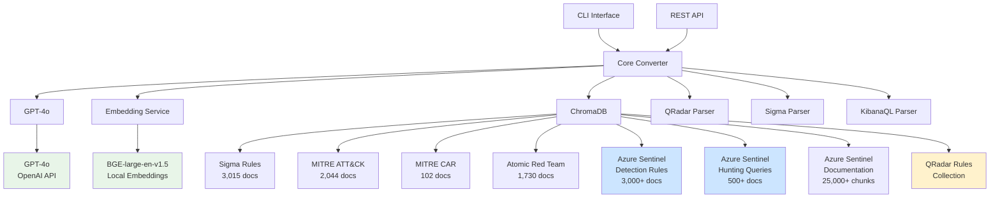

# Canonical SIEM Rule Converter

<div align="center">


**An intelligent SIEM rule converter that transforms security detection rules between different formats using GPT-4o and contextual intelligence.**

[Features](#-features) • [Quick Start](#-quick-start) • [Documentation](#-documentation) • [License](#-license)

</div>

---

## 🆕 **GPT-4o Integration**

**ADVANCED MODEL**: Canonical uses **GPT-4o by OpenAI** as the advanced language model for superior performance!

### 🚀 **Why GPT-4o?**
- **🎯 State-of-the-Art**: Latest OpenAI model with advanced reasoning capabilities
- **📈 Superior Performance**: Industry-leading language understanding and generation
- **🛡️ Versatile Expertise**: Excellent performance across security and technical domains
- **🔧 SIEM Optimized**: Enhanced rule conversion accuracy through advanced prompting
- **🏢 Enterprise Ready**: API-based access, scalable, and reliable

### 💾 **System Requirements**
- **Memory**: 8GB+ RAM for optimal performance
- **Network**: Stable internet connection for API access
- **API Key**: Valid OpenAI API key required

---

## 🎯 Overview

Canonical is an advanced SIEM rule converter designed specifically for **Security Operations Centers (SOCs)**, **Managed Detection and Response (MDR)** services, and **enterprise cybersecurity teams**. It leverages GPT-4o and comprehensive intelligence to provide context-aware, intelligent rule conversions with high accuracy and comprehensive security intelligence.

### 🏢 Target Audience
- **Security Operations Centers (SOCs)**
- **Managed Detection and Response (MDR) providers**
- **Corporate cybersecurity teams**
- **Security researchers and analysts**
- **Educational institutions (cybersecurity programs)**
- **Organizations migrating from QRadar to Azure Sentinel**

## ✨ Features

### 🔄 **Multi-Format Rule Conversion**
- **Sigma** → **KustoQL** (Azure Sentinel)
- **Sigma** → **KibanaQL** (Elastic SIEM)
- **Sigma** → **EQL** (Event Query Language)
- **Sigma** → **Splunk SPL** (Splunk Enterprise Security)
- **Sigma** → **QRadar AQL** (IBM QRadar)
- **QRadar** → **KustoQL** (Azure Sentinel)
- **KibanaQL** → **KustoQL** (Azure Sentinel) - **🆕 NEW**
- **KibanaQL** → **KibanaQL** (Elastic SIEM) - **🆕 NEW**
- **KibanaQL** → **EQL** (Event Query Language) - **🆕 NEW**
- **KibanaQL** → **QRadar AQL** (IBM QRadar) - **🆕 NEW**
- **KibanaQL** → **Splunk SPL** (Splunk Enterprise Security) - **🆕 NEW**
- **KibanaQL** → **Sigma** (Universal Detection Format) - **🆕 NEW**

**Total**: **12 conversion paths** across **3 source formats** and **6 target formats**

### 🧠 **GPT-4o Intelligence**
- **Advanced Language Processing**: GPT-4o with superior reasoning and understanding capabilities
- **Context-Aware Conversions**: Uses vector similarity search across 35,000+ security documents
- **Enhanced Azure Sentinel Context**: 25,000+ documentation chunks for superior KustoQL conversions
- **MITRE ATT&CK Integration**: Automatic technique mapping and enrichment
- **Confidence Scoring**: AI-generated confidence levels for each conversion (85-95%+)
- **Semantic Understanding**: State-of-the-art language model for accurate translations
- **API-Based Processing**: Reliable cloud-based processing with OpenAI's infrastructure

### 📊 **Comprehensive Knowledge Base**
- **3,015 Sigma Rules** from SigmaHQ repository
- **3,000+ Azure Sentinel Detection Rules** from Microsoft's GitHub repository
- **500+ Azure Sentinel Hunting Queries** for threat hunting context
- **25,000+ Azure Sentinel Documentation Chunks** from comprehensive 3000-page PDF - **🆕 NEW**
- **2,044 MITRE ATT&CK** techniques, tactics, groups, and mitigations
- **102 MITRE CAR** analytics for additional detection context
- **1,730 Atomic Red Team** tests for validation procedures
- **QRadar Rules Collection** for similarity analysis and context enhancement

**Total**: **35,000+ documents** for context-aware conversions

### 🔄 **QRadar Migration Support**
- **Comprehensive QRadar Parser**: Supports EVENT, FLOW, OFFENSE, and COMMON rule types
- **Advanced Field Mapping**: Intelligent QRadar → KustoQL field translation
- **Operator Conversion**: QRadar operators → KustoQL equivalents (=, ilike, matches, etc.)
- **Time Window Translation**: QRadar time expressions → KustoQL `ago()` syntax
- **Context Enhancement**: Uses Azure Sentinel examples for better conversion accuracy
- **Batch Processing**: Convert large QRadar rule sets efficiently
- **Validation & Quality**: Rule syntax checking and confidence scoring

### 🚀 **Enterprise-Ready**
- **REST API**: Full API server with OpenAPI documentation
- **CLI Interface**: Command-line tools for batch processing
- **Docker Support**: Containerized deployment
- **Scalable Architecture**: From single-node to microservices

## 🚀 Quick Start

### Prerequisites
- Python 3.9+
- 8+ GB RAM (for local processing)
- 10+ GB storage space
- Git

### Installation

```bash
# Clone the repository
git clone https://github.com/dier/canonical.git
cd canonical

# Install dependencies
pip3 install -r requirements.txt

# Configure environment
cp env.example .env
# Edit .env with your settings

# Initialize data (one-time setup)
python3 -m src.canonical.cli data ingest-all --force-refresh

# Start API server
python3 -m src.canonical.cli serve --host 0.0.0.0 --port 8000
```

### Docker Deployment

```bash
# Build and run with Docker Compose
docker-compose up -d

# Initialize data (one-time setup)
docker-compose exec canonical python -m src.canonical.cli data ingest-all --force-refresh

# Check status
docker-compose ps
curl http://localhost:8000/health
```

### Usage Examples

#### Convert a Single Rule
```bash
# Convert Sigma rule to KustoQL
python -m src.canonical.cli convert --source-format sigma rule.yml kustoql

# Convert QRadar rule to KustoQL  
python -m src.canonical.cli convert --source-format qradar qradar_rule.txt kustoql

# Convert with output file
python -m src.canonical.cli convert --source-format sigma rule.yml kustoql -o converted.kql
```

#### Batch Processing
```bash
# Convert multiple rules
python -m src.canonical.cli batch-convert --source-format sigma rules/ kustoql output/

# Convert with specific patterns
python -m src.canonical.cli batch-convert --source-format sigma "rules/*.yml" kustoql output/
```

#### API Usage
```python
import requests

# Convert via API
response = requests.post("http://localhost:8000/convert/sigma/kustoql", 
                        json={"rule": sigma_rule_content})
result = response.json()
print(result["target_rule"])
```

## 📖 Documentation

### 🎓 Getting Started
- [Installation Guide](docs/installation.md) - Detailed setup instructions
- [Configuration Guide](docs/configuration.md) - Environment and model configuration
- [Quick Start Tutorial](docs/quickstart.md) - Your first rule conversion

### 🔧 User Guides
- [CLI Reference](docs/cli.md) - Command-line interface documentation
- [API Documentation](docs/api.md) - REST API endpoints and usage
- [Conversion Formats](docs/formats.md) - Supported input and output formats
- [QRadar Migration Guide](docs/qradar-migration.md) - Complete migration workflow

### 🏗️ Technical Documentation
- [Architecture Overview](docs/architecture.md) - System design and components
- [GPT-4o Integration](docs/gpt-4o-integration.md) - LLM configuration and optimization
- [Data Sources](docs/data-sources.md) - Knowledge base and ingestion
- [Development Guide](docs/development.md) - Contributing and extending
- [Performance Tuning](docs/performance.md) - Optimization techniques

### 🎓 Examples and Tutorials
- [Basic Usage Examples](examples/) - Simple conversion examples
- [QRadar to KustoQL Migration](examples/qradar_to_kustoql_example.py) - QRadar migration example
- [Integration Patterns](docs/integration.md) - Common integration scenarios
- [Custom Extensions](docs/extensions.md) - Building custom converters

## 🏗️ Architecture



## 📊 Performance

### Conversion Speed
- **Sigma Rules**: 2-5 seconds per rule (CPU only)
- **QRadar Rules**: 5-15 seconds per rule (includes context gathering)
- **Batch Processing**: 50-200 rules/minute
- **GPT-4o Processing**: Fast API-based processing

### Accuracy Metrics
- **Conversion Success Rate**: >95% for Sigma, >90% for QRadar
- **Confidence Scores**: 0.85-0.98 average for Sigma, 0.75-0.95 for QRadar
- **MITRE Mapping Accuracy**: >90%
- **Field Mapping Accuracy**: >95% for common fields

### Resource Requirements
- **RAM**: 8GB minimum for local processing, 16GB for optimal performance
- **Storage**: 15GB for complete dataset and models
- **GPU**: Optional but recommended (16GB+ VRAM)
- **CPU**: 8+ cores recommended for production

## 📄 License

**Custom License for SOC/MDR/Corporate Use**

This software is provided under a custom license for internal use within:
- 🏢 **Security Operations Centers (SOCs)**
- 🛡️ **Managed Detection and Response (MDR) services**  
- 🏗️ **Corporate cybersecurity teams**
- 🎓 **Educational institutions** (cybersecurity programs)

### Permitted Uses
- ✅ Internal security operations and threat detection
- ✅ Rule migration and SIEM platform transitions
- ✅ Security research and threat intelligence
- ✅ Educational and training purposes
- ✅ Modification and customization for internal use

### Restrictions
- ❌ Commercial redistribution or resale
- ❌ Public hosting as a service
- ❌ Integration into commercial security products for resale

For licensing inquiries and commercial use cases:
- 📧 **Email**: licensing@dier.org
- 🔧 **Professional Services**: Implementation and customization

## 🙏 Acknowledgments

### Data Sources
- **SigmaHQ**: Sigma detection rules repository
- **Microsoft**: Azure Sentinel detection rules and hunting queries
- **MITRE Corporation**: ATT&CK framework and CAR analytics
- **Red Canary**: Atomic Red Team testing procedures
- **IBM**: QRadar rule format specifications

### Technology Stack
- **OpenAI**: GPT-4o language model and API infrastructure
- **BGE**: Text embedding model by BAAI
- **ChromaDB**: Vector database for semantic search
- **FastAPI**: Modern web framework for APIs

---

<div align="center">

[⭐ Star this repo](https://github.com/dier/canonical) • [🐛 Report bug](https://github.com/dier/canonical/issues) • [💡 Request feature](https://github.com/dier/canonical/discussions)

</div> 